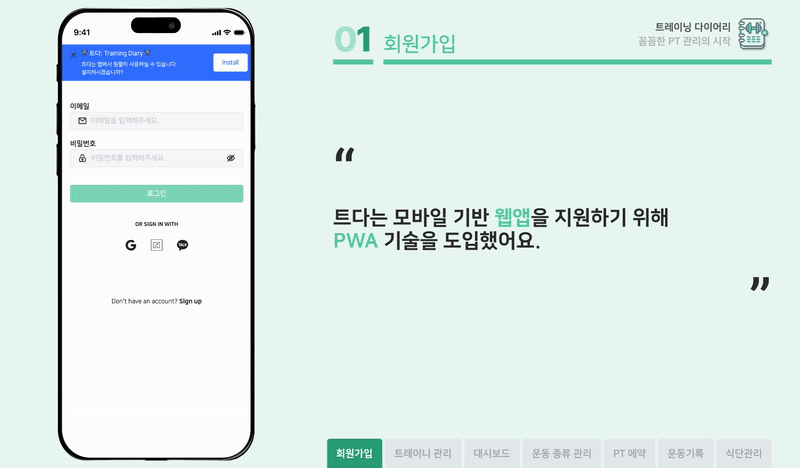
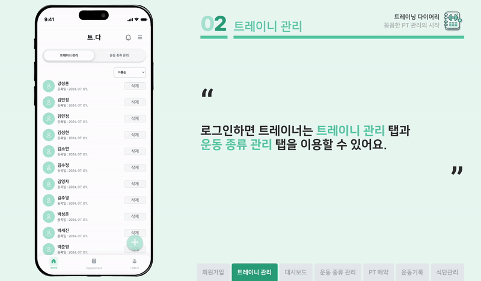
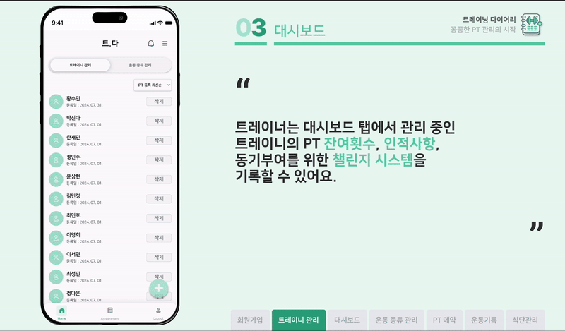
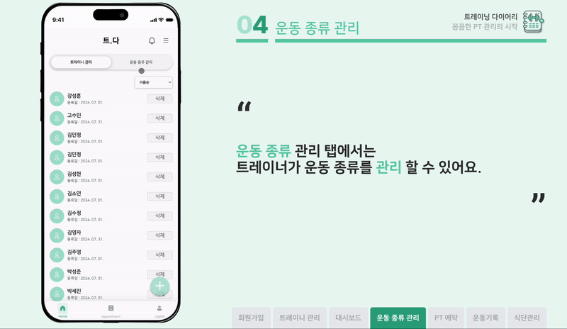
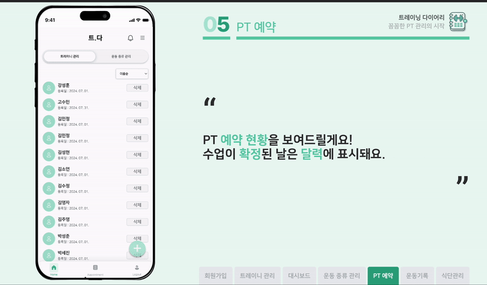
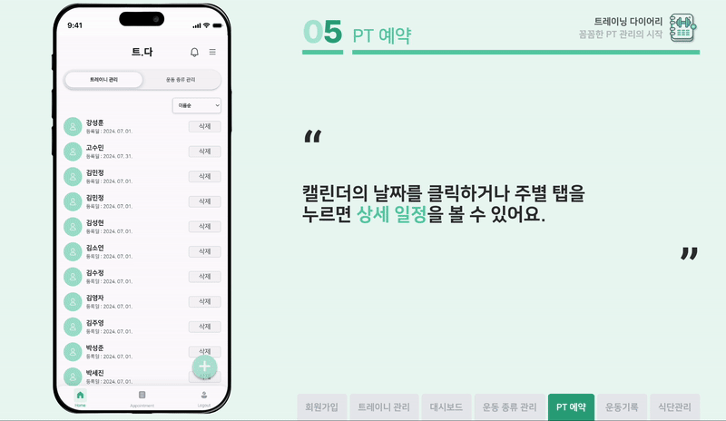
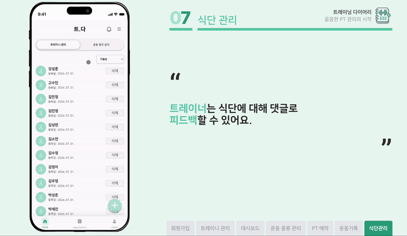
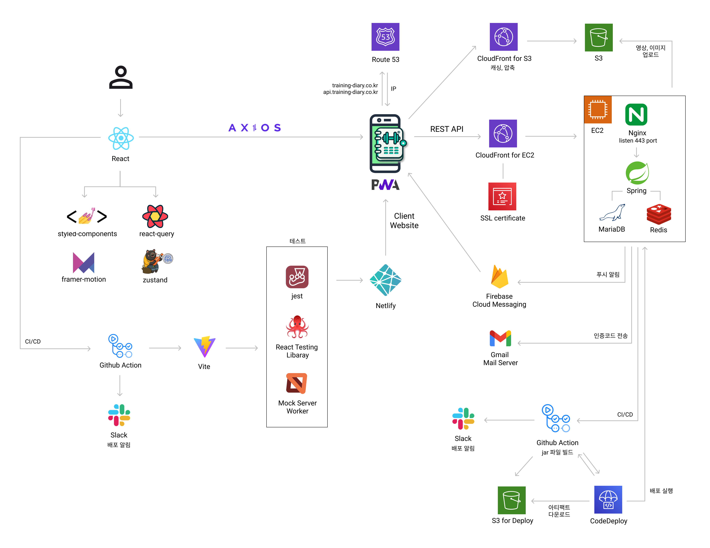
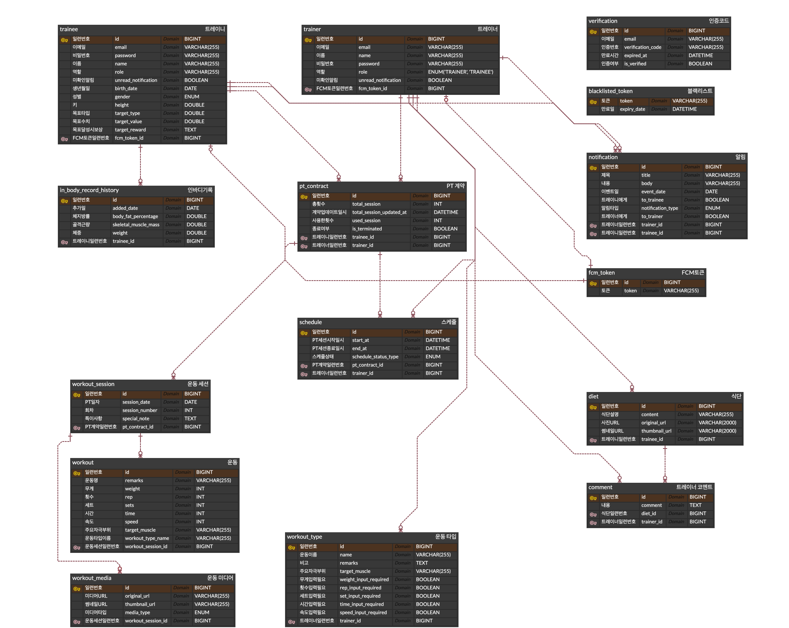

# 트레이닝 다이어리(트다)

트레이너의 효율적인 트레이니 관리 플랫폼 - **Training Diary**

### PT 예약, 트레이닝 세션과 식단 관리를 한 곳에서 해결하세요!

- 🗓️  여러 회원과의 일정을 관리해주는 PT 예약

- 📝  트레이니 혼자서도 할 수 있도록 운동 기록 작성

- 📈  트레이니의 신체 변화를 추적할 수 있는 대시보드

- 🍽️  꾸준한 식단 관리 피드백을 받을 수 있는 공간

### 프로젝트 배경 및 기대효과

- 프로젝트 전체 페이지에서 설명 - https://github.com/TrainingDiary

## 사용해보기

- https://training-diary.co.kr

    - 운영예정일: 2024.8.1. ~ 2025.7.31.

    - 이메일로 회원가입 후 사용할 수 있습니다.

    - 동영상 업로드 기능은 운영비용 문제로 제외되었습니다.

## 시연영상

- [시연 영상 보러가기](https://www.notion.so/marcel-manual/Training-Diary-9a4729c1df6c4150a189540024803657?pvs=4#928d5ed35f05450aaf050dde4443f318)

## 주요기능

- 회원가입 및 로그인

    

- 트레이니 관리

    

- 트레이니 대시보드

    

- 트레이니에게 제공할 운동 종류

    

- PT 예약

    

    

- 그날의 운동 기록

    

- 트레이니 식단 공유

    

    

## 사용 기술 스택

- Java 17
- Springboot
- DB
    - MariaDB
    - Redis
- Gradle
- JWT
- Lombok
- Spring Security
- Spring Data JPA
- Swagger
- Google Mail Sender
- Caffeine Cache
- Cloudfront CDN
- AWS S3
- Imgscalr
- FFMPEG Encoding
- Firebase Cloud Messaging
- QueryDSL
- Test
    - JUnit
    - Mockito
    - Postman
- CI/CD
    - Github Actions
    - AWS CodeDeploy

## 인프라 구성

## API 문서

- Swagger API - https://api.training-diary.co.kr/swagger-ui/index.html

## ERD 다이어그램

## 트러블슈팅

- [트러블슈팅 노션 페이지](https://www.notion.so/marcel-manual/Training-Diary-9a4729c1df6c4150a189540024803657?pvs=4#d41e66821b1f425f9d3714da08d56b1a)
